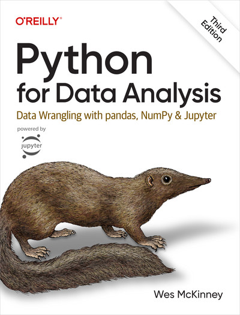

# How to use these notes:
1. Activate the virtual enviroment (in terminal): source .venv/bin/activate
2. Activate the jupyter notebook: jupyter notebook
3. Deactivate the notebook: from the UI 
4. Deactivate the virtual enviroment (in terminal): deactivate

## What do we talk about? 
The notes you will find in this repository offer an introductory course on using Python for data analysis. 
The book *Python for Data Analysis* by Wes McKinney has been used as main source. 

---

# Guide to Chapters Content 
0. **Python Tips and Tricks**: some tips, tricks and utilities of Python are shown. This one is an introductory chapter to make sure that we are on the same page
1. **Numpy Introduction and Vectorized Computations**: in this chapter we give an elementary intrducrion to NumPy. Topics like arrays, slicing, filtering and unversal functions are covered
2. **Pandas Introduction**: in this chapter a basic introduction to *pandas* is provided. There is also a simple example on time-series.
3. **Data Wrangling**: preparing data for analysis
4. **Plotting and Visualization**: leveraging _matplotlib_ for data visualization
5. **Altair**
   - **Introduzione**: _Vega Altair_ in a nutshell
   - **Typer, Marks, Channels**: main building blocks of _Altair_ 
   - **Trasformazioni sui dati**: transforming data with _Altair_ for straight-to-the-point visuals
   - **Axes, Scales and Legends**: unsang heroes of visualization
