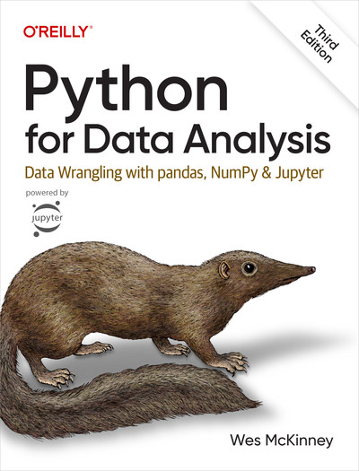
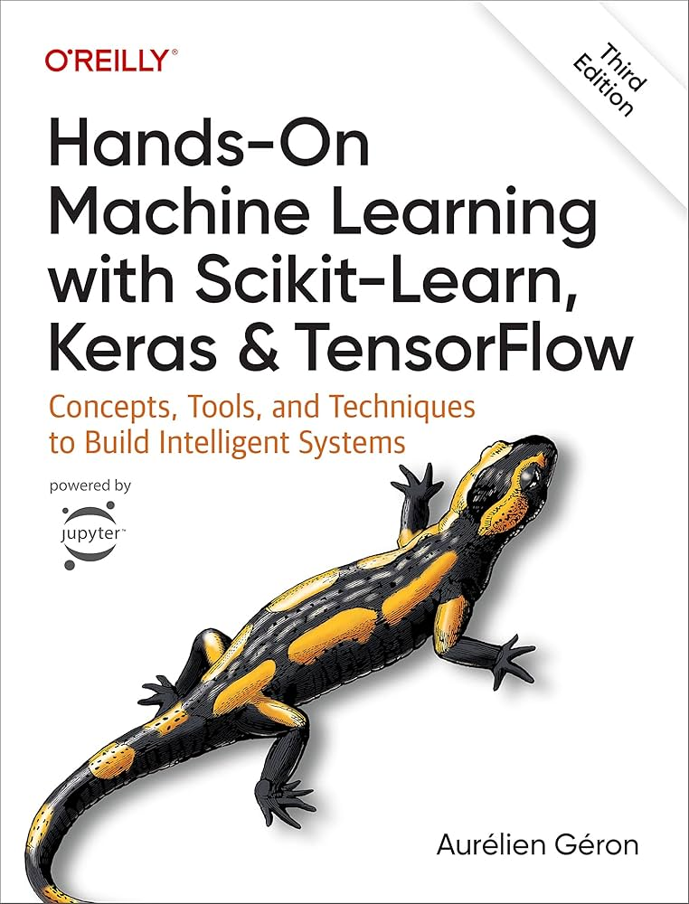
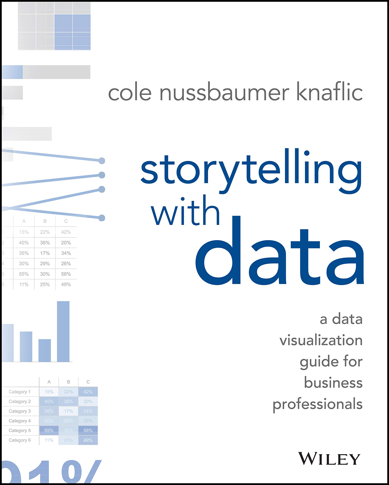

# Come utilizzare questi appunti:
1. Attiva l'ambiente virtuale (nel terminale): source .venv/bin/activate
2. Attiva il jupyter notebook: jupyter notebook
3. Disattiva il notebook: dall'interfaccia utente (UI)
4. Disattiva l'ambiente virtuale (nel terminale): deactivate

## Di cosa parliamo? 
Gli appunti che troverai in questa repository offrono un corso introduttivo sull'utilizzo di Python per l'analisi dei dati.
Il libro *Python for Data Analysis* di Wes McKinney è stato utilizzato come fonte principale. Tuttavia anche altri testi di riferimento sono stati preziosi. 

<table>
  <tr>
    <td align="center">
      
       
    </td>
    <td align="center">
      
       
    </td>
    <td align="center">
      
       
    </td>
  </tr>
</table>

Rimando anche alla documentazione delle verie librerie utilizzate nei Notebook: 

- [pandas](https://pandas.pydata.org/docs/)
- [numpy](https://numpy.org/doc/)
- [streamlit](https://docs.streamlit.io/)
- [Altair](https://altair-viz.github.io/)
- [Matplotlib](https://matplotlib.org/stable/index.html)
- [ScikitLearn](https://scikit-learn.org/stable/)
- [Seaborne](https://seaborn.pydata.org/)

# Guida ai Contenuti dei Capitoli 
0. **Consigli e Trucchi Python**: vengono mostrati alcuni consigli, trucchi e utilità di Python. Questo è un capitolo introduttivo per assicurarci di essere tutti allineati.
1. **Introduzione a Numpy e Calcoli Vettorializzati**: in questo capitolo forniamo un'introduzione elementare a NumPy. Vengono trattati argomenti come array, slicing, filtraggio e funzioni universali.
2. **Introduzione a Pandas**: in questo capitolo viene fornita un'introduzione di base a *pandas*. C'è anche un semplice esempio sulle serie temporali.
3. **Data Wrangling**: preparazione dei dati per l'analisi.
4. **Grafici e Visualizzazione**: sfruttare _matplotlib_ per la visualizzazione dei dati.
5. **Altair**
   - **Introduzione**: _Vega Altair_ in sintesi.
   - **Types, Marks, Channels**: i principali blocchi costitutivi di _Altair_.
   - **Trasformazioni sui dati**: trasformare i dati con _Altair_ per visualizzazioni dirette ed efficaci.
   - **Axes, Scales and Legends**: gli eroi silenziosi della visualizzazione.
 6. **Operazioni di Aggregazione e Raggruppamento**: introduzione ai metodi `crosstab()`, `pivot_table()`, `groupby()` ed `apply()` in un'ottica di operazioni di aggregazione dati.